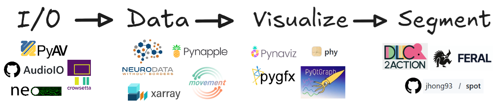

:hide-toc:

.. toctree::
   :maxdepth: 2
   :hidden:

   getting_started/index
   advanced/index
   examples/index
   api_index
   community/index

ethograph
=========

EthoGraph is a graphical user interface for visualizing and segmenting
multimodal timeseries behavioural data. It builds upon a number of :ref:`open-source
libraries <target-support>` to load and quickly render video and pose files, audio and
spectrograms, ephys recordings in various formats, and arbitrary
multi-dimensional timeseries — all on one shared timeline.

Note this GUI is still in development. I welcome people testing it and
:doc:`providing feedback <community/contributing>`!

.. raw:: html

   
   

     
<iframe src="https://player.vimeo.com/video/1206424641?badge=0&amp;autopause=0&amp;player_id=0&amp;app_id=58479" frameborder="0" allow="autoplay; fullscreen; picture-in-picture; clipboard-write; encrypted-media; web-share" referrerpolicy="strict-origin-when-cross-origin" style="position:absolute;top:0;left:0;width:100%;height:100%;" title="Ethograph Demo"></iframe>

   

   

Quickstart
----------

.. raw:: html

   

   <button class="dcbtn" onclick="dcOpen()">&#128269; Is my data compatible?</button>

   

    

     

       <h3>Data compatibility helper</h3>
       <button class="dcx" onclick="dcClose()" aria-label="Close">&times;</button>
     

     

       
Are you working with NWB files?

       
<code>.nwb</code> files are self-contained &mdash; EthoGraph loads them directly.

       

         <label class="dcc"><input type="radio" name="dcnwb" value="yes" onchange="dcRad(this,'nwb')">
           
<strong>Yes &mdash; I have .nwb files</strong>From DANDI, NeuroConv, or another NWB pipeline
</label>
         <label class="dcc"><input type="radio" name="dcnwb" value="no" onchange="dcRad(this,'nwb')">
           
<strong>No &mdash; I have raw files</strong>Video, audio, pose, ephys, numpy&hellip;
</label>
       

       
Please select an option.

     

     

       
What do you want to visualise?

       
Select everything that applies.

       

         <label class="dcc"><input type="checkbox" onchange="dcChk(this,'video')">
           
<strong>Videos</strong>.mp4 camera recordings
</label>
         <label class="dcc"><input type="checkbox" onchange="dcChk(this,'pose')">
           
<strong>Pose estimation</strong>DeepLabCut, SLEAP, LightningPose
</label>
         <label class="dcc"><input type="checkbox" onchange="dcChk(this,'audio')">
           
<strong>Audio / spectrogram</strong>.wav, .mp3, or video with sound
</label>
         <label class="dcc"><input type="checkbox" onchange="dcChk(this,'ephys')">
           
<strong>Electrophysiology</strong>Raw ephys or spike-sorted units (Kilosort)
</label>
         <label class="dcc"><input type="checkbox" onchange="dcChk(this,'numpy')">
           
<strong>Custom feature array</strong>Pre-computed signals as .npy
</label>
         <label class="dcc"><input type="checkbox" onchange="dcChk(this,'other')">
           
<strong>Other / custom format</strong>Not listed above
</label>
       

       

         
Multiple cameras?

         
i.e. several video or pose files recorded simultaneously.

         

           <label class="dcc"><input type="radio" name="dccam" value="single" onchange="dcRad(this,'cameras')">
             
<strong>No &mdash; single camera</strong>
</label>
           <label class="dcc"><input type="radio" name="dccam" value="multi" onchange="dcRad(this,'cameras')">
             
<strong>Yes &mdash; multiple cameras</strong>
</label>
         

       

       

         
How is your audio stored?

         
All three work with drag &amp; drop; separate files per mic come with a caveat.

         

           <label class="dcc"><input type="radio" name="dcaud" value="single" onchange="dcRad(this,'audio_setup')">
             
<strong>Single microphone</strong>
</label>
           <label class="dcc"><input type="radio" name="dcaud" value="multichannel" onchange="dcRad(this,'audio_setup')">
             
<strong>One multichannel file</strong>All mics in a single .wav
</label>
           <label class="dcc"><input type="radio" name="dcaud" value="multi_files" onchange="dcRad(this,'audio_setup')">
             
<strong>One file per microphone</strong>
</label>
         

       

       

         
Have you already labelled this audio elsewhere?

         
Existing annotations can be imported rather than redone.

         

           <label class="dcc"><input type="radio" name="dclbl" value="no" onchange="dcRad(this,'labelled')">
             
<strong>No &mdash; I'll label in EthoGraph</strong>
</label>
           <label class="dcc"><input type="radio" name="dclbl" value="yes" onchange="dcRad(this,'labelled')">
             
<strong>Yes &mdash; in Audacity, Praat, evsonganaly&hellip;</strong>
             Or another annotation tool
</label>
         

       

       
Please answer every question above.

     

     

       
Does your data have a trial structure?

       
Yes if you have separate files per trial, or one continuous recording in which you
       want to define trial windows.

       

         <label class="dcc"><input type="radio" name="dctr" value="no" onchange="dcRad(this,'trials')">
           
<strong>No &mdash; one continuous session</strong>
</label>
         <label class="dcc"><input type="radio" name="dctr" value="yes" onchange="dcRad(this,'trials')">
           
<strong>Yes &mdash; trials or epochs</strong>
</label>
       

       
Please select an option.

     

     

     

       <button class="dcb dcb-s" id="dcback" onclick="dcPrev()" style="visibility:hidden">&larr; Back</button>
       <button class="dcb dcb-p" id="dcnext" onclick="dcNext()">Next &rarr;</button>
     

    

   

   

Installation
------------

EthoGraph is installed with `uv <https://docs.astral.sh/uv/>`_, a fast Python package manager:

.. tab-set::

   .. tab-item:: macOS / Linux

      .. code-block:: bash

         curl -LsSf https://astral.sh/uv/install.sh | sh

   .. tab-item:: Windows

      .. code-block:: bash

         winget install astral-sh.uv

      Works from both PowerShell and Command Prompt; ``winget`` is built into Windows 11.

Then install the GUI as a standalone tool — one command, no environment to create or activate:

.. code-block:: bash

   uv tool install --python 3.12 "ethograph[gui,audio]"

To open the GUI, run:

.. code-block:: bash

   ethograph check # Linux only : Check for missing libraries
   ethograph launch

.. note::
   For installing into a dedicated virtual environment, optional extras, and **troubleshooting**, see the
   :doc:`installation guide <getting_started/installation>`.

After launching, there are some :doc:`example datasets <examples/index>` you can explore the GUI. To
learn more about all the functionalities, I recommend the
:doc:`user manual <getting_started/user_manual>`.

.. _target-support:

Support
-------

EthoGraph is built on top of a number of open-source projects:
`PyAV <https://pyav.org/docs/stable/>`_,
`audioio <https://github.com/bendalab/audioio>`_,
`Neo <https://neo.readthedocs.io>`_,
`crowsetta <https://github.com/vocalpy/crowsetta>`_,
`Neurodata Without Borders <https://www.nwb.org/>`_,
`xarray <https://docs.xarray.dev/>`_,
`pynapple <https://pynapple.org/index.html>`_,
`movement <https://movement.neuroinformatics.dev/>`_,
`phy <https://github.com/cortex-lab/phy>`_,
`PyQtGraph <https://www.pyqtgraph.org/>`_, and
`pygfx <https://pygfx.org/>`_ (via
`pynaviz <https://github.com/pynapple-org/pynaviz>`_).
